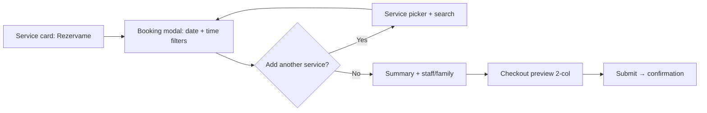

# Rezervame Web UI Fix Report

**Source:** `Points_to_Review_Rezervame_EN.pdf` (26 user-panel items)  
**Date:** May 20, 2026  
**Scope:** Web app (`Web/`) — customer-facing UI at [rezervame-web.firebaseapp.com](https://rezervame-web.firebaseapp.com)  
**Build:** `cd Web && npm run build` — **passed**

---

## Executive summary

All 26 PDF review points were addressed in the Web codebase. Changes follow the Rezervame 2.0 mockup direction: flatter header with integrated search, tighter home spacing, Booksy-style venue booking (modal-first, no page cart bar), unified venue sidebar, compact search list + map UX, and profile/checkout polish.

Mobile (`Mobile/`) was **not** in the PDF scope; prior session fixes (reservations API size, gender dropdown) remain separate.

---

## Item-by-item status

| # | Area | Status | Notes |
|---|------|--------|-------|
| 1 | Home — “Servicios destacados” + chips | **Done** | Label above chips; rectangular equal chips; increased horizontal gap (`Web/src/app/page.tsx`) |
| 2 | Home — section spacing | **Done** | Reduced vertical margins between blocks (`page.tsx`) |
| 3 | Home — header search bar | **Done** | Flat white bar in header next to logo, no outer shadow (`Header.tsx`, `HeaderSearchBar.tsx`) |
| 4 | Home — categories carousel width | **Done** | Full-width carousel on large desktop (`page.tsx`) |
| 5 | Home — “Cómo funciona” | **Done** | Larger icons/text; improved contrast (`page.tsx`) |
| 6 | Footer | **Done** | Compact padding/spacing (`Footer.tsx`) |
| 7 | Search — map markers + pin card | **Done** | Normal/active/secondary opacity; compact card at active pin (`search/page.tsx`) |
| 8 | Search — “Mostrar mapa” toggle | **Done** | Control moved to top-right of map (`search/page.tsx`) |
| 9 | Search — duplicate search removed | **Done** | Search only in global header (`search/page.tsx`, `Header.tsx`) |
| 10 | Search — compact horizontal cards | **Done** | List cards restyled for density (`search/page.tsx`) |
| 11 | Venue — header like search | **Done** | Venue name/category via `PageHeaderMetaContext` (`VenueClient.tsx`, `Header.tsx`) |
| 12 | Venue — sticky “Reservar ahora” | **Done** | Appears on scroll down (`VenueClient.tsx`) |
| 13 | Venue — portfolio + lightbox | **Done** | Preview strip, portfolio tab grid, fullscreen lightbox (`VenueClient.tsx`) |
| 14 | Venue — contact in sidebar | **Done** | Phone/email in unified info block (`VenueClient.tsx`) |
| 15 | Venue — sentence case / readability | **Done** | Description and blurbs use normal weight, not all-caps italic (`VenueClient.tsx`) |
| 16 | Venue — audience filters | **Done** | Women / Men / Kids / Promotions when tags match (`VenueClient.tsx`) |
| 17 | Venue — service list layout | **Done** | Compact horizontal rows; single **Rezervame** CTA (no +/- cart on page) (`VenueClient.tsx`) |
| 18 | Venue — map + info container | **Done** | Single card: map, about, hours, contact, brand-red social icons (`VenueClient.tsx`) |
| 19 | Venue — team section | **Done** | Larger type, horizontal carousel, shorter cards (`VenueClient.tsx`) |
| 20 | Venue — “Elige tu categoría” | **Done** | Reduced top padding and title scale (`VenueClient.tsx`) |
| 21 | Booking flow (Booksy-style) | **Done** | Click **Rezervame** → modal; schedule first with mañana/tarde/noche; add-service overlay with search; no sticky cart bar (`VenueClient.tsx`, `BookingModal.tsx`) |
| 22 | Payment / checkout UI | **Done** | Wider modal; 2-column checkout summary; Card / Yappy / Cash tabs; profile pay modal 2-column method grid (`BookingModal.tsx`, `profile/page.tsx`) |
| 23 | Confirmation page | **Done** | No internal scroll; compact card; `line-clamp` on location (`reservations/confirmation/page.tsx`) |
| 24 | Invoice download toast position | **Done** | Sonner `top-center` (`AppToaster.tsx`) |
| 25 | Invoices table | **Done** | Centered headers; `whitespace-nowrap` on invoice # (`profile/page.tsx`) |
| 26 | Settings notifications | **Done** | Email-only toggle; SMS/WhatsApp removed (`profile/page.tsx`) |

---

## Files created

| File | Purpose |
|------|---------|
| `Web/src/components/HeaderSearchBar.tsx` | Rezervame 2.0 flat dual-field search |
| `Web/src/contexts/PageHeaderMetaContext.tsx` | Dynamic title/subtitle for search & venue headers |
| `UI_FIX_REPORT.md` | This report |

---

## Files modified (primary)

| File | Changes |
|------|---------|
| `Web/src/app/layout.tsx` | `PageHeaderMetaProvider` |
| `Web/src/components/Header.tsx` | Integrated search, venue/search meta line, flatter chrome |
| `Web/src/app/page.tsx` | Hero chips, spacing, categories, how-it-works |
| `Web/src/components/Footer.tsx` | Tighter footer |
| `Web/src/app/search/page.tsx` | Map markers, toggle position, compact cards, header meta |
| `Web/src/app/venue/[id]/VenueClient.tsx` | Full venue UX per items 11–20 |
| `Web/src/components/BookingModal.tsx` | Booksy flow, time filters, service search, 2-col checkout |
| `Web/src/app/reservations/confirmation/page.tsx` | No scroll, overflow fixes |
| `Web/src/app/profile/page.tsx` | Invoices table, email notifications, 2-col payment methods |
| `Web/src/components/AppToaster.tsx` | Top-center toasts |

---

## Booking flow (after)



**Removed from venue page:** multi-select +/- on services, sticky cart counter, cross-venue cart replace dialog.

---

## Deploy

To publish Web changes to Firebase:

```bash
cd Web
npm run build
npm run deploy:web
```

Admin deploy is unchanged unless you also modified `Admin/`.

---

## Testing checklist

- [ ] Home: chips layout, header search, section spacing, footer
- [ ] Search: header title, map toggle top-right, marker states, compact cards
- [ ] Venue: sticky book bar, portfolio/lightbox, filters, Rezervame opens modal, unified sidebar
- [ ] Booking modal: mañana/tarde/noche, add service + search, checkout 2 columns
- [ ] `/reservations/confirmation` — no inner scrollbar
- [ ] Profile → Invoices: table alignment, download toast at top
- [ ] Profile → Settings: email-only notifications

---

## Out of scope / follow-ups

- **Yappy** tab is visual-only until a Yappy payment integration exists.
- **Interactive embedded map** on venue sidebar still links to OpenStreetMap search (full embed can be a later enhancement).
- **Service audience tags** depend on API `category`/tag data; filters appear when matching tags exist on services.
- **Mobile app** UI was not part of the PDF; no changes required there for this review.

---

*Generated from implementation against `Points_to_Review_Rezervame_EN.pdf`.*
